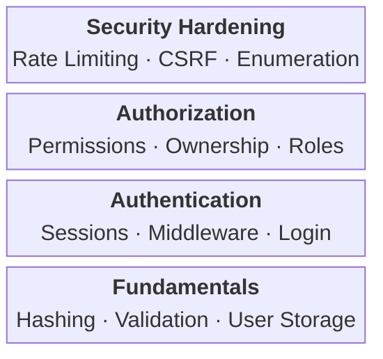

# scaling-octo-waffle

My notes on implementing authentication for this project. Documenting patterns I used, mostly for my own reference. Adapt what's useful, ignore what isn't.

## Table of Contents

-   Getting Started

    -   [Implementation Layers](#implementation-layers)

-   Fundamentals

    -   [Password Storage](#password-storage)

-   Authentication

    -   [Session-Based Authentication](#session-based-authentication)
    -   [JWT Authentication](#jwt-authentication)
    -   [Refresh Token Pattern](#refresh-token-pattern)
    -   [Authentication Middleware Architecture](#authentication-middleware-architecture)

-   Authorization

    -   [Permission-Based Access Control](#permission-based-access-control)
    -   [Ownership-Based Access Control](#ownership-based-access-control)

-   Security Hardening

    -   [Token Security](#token-security)
    -   [Rate Limiting and Account Lockout](#rate-limiting-and-account-lockout)
    -   [CSRF Prevention](#csrf-prevention)
    -   [User Enumeration Prevention](#user-enumeration-prevention)

-   User Flows

    -   [Password Reset](#password-reset)
    -   [Email Verification](#email-verification)
    -   [Extended Session Duration](#extended-session-duration)

-   Appendix
    -   [References](#references)
    -   [Revision History](#revision-history)
    -   [Future Additions](#future-additions)

# Implementation Layers

Authentication as layers. Each layer depends on the one below it:



Build from bottom to top.

# Fundamentals

Core building blocks for secure credential handling.

## Password Storage

### Hashing Algorithm

Argon2id, balanced resistance against both GPU-based attacks and side-channel attacks.

**Parameters (OWASP minimum):**

| Parameter       | Value              | Description           |
| --------------- | ------------------ | --------------------- |
| Memory (m)      | 19456 KiB (19 MiB) | Minimum memory cost   |
| Iterations (t)  | 2                  | Time cost             |
| Parallelism (p) | 1                  | Degree of parallelism |

```typescript
import argon2 from "argon2";

const hash = await argon2.hash(password, {
	type: argon2.argon2id,
	memoryCost: 19456,
	timeCost: 2,
	parallelism: 1,
});
```

> **Future Enhancement:** Add fallback algorithm support for environments where Argon2id is unavailable. Recommended fallback order: (too much probably.)
>
> 1. scrypt: N=2^17, r=8, p=1
> 2. bcrypt: cost factor 10+ (72-byte password limit)
> 3. PBKDF2-HMAC-SHA256: 600,000+ iterations (FIPS-140 compliance only)

### Password Validation

| Requirement    | Value        |
| -------------- | ------------ |
| Minimum length | 8 characters |

> **Future Enhancement:** Additional validation to consider:
>
> -   Maximum length (64-128 characters) to prevent denial-of-service via long passwords
> -   Leaked password detection via Have I Been Pwned API using k-anonymity (send only first 5 characters of SHA-1 hash)

# Authentication

Establishing and maintaining user identity across requests.

## Session-Based Authentication

Server-side session management using cookies for stateful authentication.

### Session Token Structure

Compound token separating the session identifier from the session secret:

```
Token Format: <session_id>.<session_secret>
Example: 550e8400-e29b-41d4-a716-446655440000.Ks8jF2xL9pQm...
```

| Component      | Purpose                | Storage                  |
| -------------- | ---------------------- | ------------------------ |
| Session ID     | Database lookup (UUID) | Plaintext in database    |
| Session Secret | Validation             | SHA-256 hash in database |

This separation prevents timing attacks during session lookup and ensures that database leaks do not expose usable session tokens.

### Session Secret Validation

```typescript
import crypto from "node:crypto";

function hashToken(token: string): string {
	return crypto.createHash("sha256").update(token).digest("hex");
}

function secureCompare(a: string, b: string): boolean {
	if (a.length !== b.length) return false;
	return crypto.timingSafeEqual(Buffer.from(a), Buffer.from(b));
}
```

SHA-256 is appropriate for session secrets (unlike passwords) because the input has sufficient entropy (256 bits) to resist brute-force attacks.

### Cookie Attributes

Session cookies with these attributes:

| Attribute | Value         | Purpose                                    |
| --------- | ------------- | ------------------------------------------ |
| HttpOnly  | true          | Prevent JavaScript access (XSS mitigation) |
| Secure    | true          | HTTPS transmission only                    |
| SameSite  | Strict or Lax | CSRF mitigation                            |
| Path      | /             | Scope to entire application                |

```typescript
const cookieOptions = {
	httpOnly: true,
	secure: process.env.NODE_ENV === "production",
	sameSite: "strict",
	maxAge: 7 * 24 * 60 * 60 * 1000, // 7 days
};
```

### Session Lifecycle

| Event          | Action                                               |
| -------------- | ---------------------------------------------------- |
| Login          | Create new session; never reuse existing session IDs |
| Logout         | Delete session from database; clear cookie           |
| Password reset | Invalidate all sessions for the user                 |

### Successful Login Side Effects

Beyond creating a session, successful authentication should trigger additional state updates:

```typescript
async function login(email: string, password: string): Promise<LoginResult> {
	const user = await verifyCredentials(email, password);

	return await withTransaction(async (client) => {
		/* Reset failed login counter */
		await userRepository.resetFailedLoginAttempts(user.id, client);

		/* Update last login timestamp for audit */
		await userRepository.updateLastLogin(user.id, client);

		/* Create session */
		const session = await sessionRepository.create(
			{
				user_id: user.id,
				expires_at: calculateExpiration(),
				/* ... other fields */
			},
			client
		);

		return { session, user };
	});
}
```

| Side Effect                        | Purpose                              |
| ---------------------------------- | ------------------------------------ |
| Reset failed login attempts        | Clear lockout counter on success     |
| Update last login timestamp        | Audit trail, detect dormant accounts |
| Create session in same transaction | Ensure atomic state change           |

Using a transaction ensures that if session creation fails, the login counter isn't incorrectly reset.

## JWT Authentication

JSON Web Tokens provide stateless authentication where the token itself contains the authentication state. This eliminates database lookups for session validation but requires careful consideration of token lifetime and revocation.

### Token Structure

JWTs consist of three parts: header, payload, and signature.

| Claim | Purpose                     | Example          |
| ----- | --------------------------- | ---------------- |
| sub   | Subject (user identifier)   | UUID             |
| email | User email                  | user@example.com |
| iat   | Issued at (Unix timestamp)  | 1704067200       |
| exp   | Expiration (Unix timestamp) | 1704153600       |

### Token Generation

```typescript
import jwt from "jsonwebtoken";

interface JwtPayload {
	sub: string;
	email: string;
	iat: number;
	exp: number;
}

function signToken(
	userId: string,
	email: string,
	secret: string,
	expiresIn: string
): string {
	return jwt.sign({ sub: userId, email }, secret, { expiresIn });
}
```

### Token Verification

```typescript
function verifyToken(token: string, secret: string): JwtPayload {
	try {
		return jwt.verify(token, secret) as JwtPayload;
	} catch (error) {
		if (error instanceof jwt.TokenExpiredError) {
			throw new AuthenticationError("Token has expired");
		}
		if (error instanceof jwt.JsonWebTokenError) {
			throw new AuthenticationError("Invalid token");
		}
		throw error;
	}
}
```

### Bearer Token Extraction

Tokens extracted from the Authorization header using the Bearer scheme:

```typescript
function extractBearerToken(authHeader: string): string | null {
	const parts = authHeader.split(" ");
	if (parts.length !== 2 || parts[0] !== "Bearer") {
		return null;
	}
	return parts[1] ?? null;
}
```

### Session-Based vs JWT Authentication

| Aspect        | Session-Based                 | JWT                           |
| ------------- | ----------------------------- | ----------------------------- |
| State         | Server-side (database)        | Client-side (token)           |
| Revocation    | Immediate (delete session)    | Delayed (wait for expiration) |
| Scalability   | Requires shared session store | Stateless, no shared state    |
| Token size    | Small (session ID only)       | Larger (contains claims)      |
| Database load | Query per request             | Query only for permissions    |

I chose session-based authentication for this project because immediate revocation matters. JWT makes more sense when stateless operation and horizontal scaling are priorities.

## Refresh Token Pattern

Refresh tokens enable long-lived authentication sessions while keeping access tokens short-lived. This limits the exposure window if an access token is compromised.

### Token Lifetimes

| Token Type    | Lifetime            | Storage                                |
| ------------- | ------------------- | -------------------------------------- |
| Access Token  | 15 minutes - 1 hour | Client memory only                     |
| Refresh Token | 7 - 30 days         | Client secure storage, server database |

### Refresh Token Schema

```sql
CREATE TABLE refresh_tokens (
    id UUID PRIMARY KEY DEFAULT gen_random_uuid(),
    user_id UUID NOT NULL REFERENCES users(id) ON DELETE CASCADE,
    token_family UUID NOT NULL,
    created_at TIMESTAMP WITH TIME ZONE DEFAULT NOW(),
    expires_at TIMESTAMP WITH TIME ZONE NOT NULL,
    revoked_at TIMESTAMP WITH TIME ZONE
);

CREATE INDEX idx_refresh_tokens_user_id ON refresh_tokens(user_id);
CREATE INDEX idx_refresh_tokens_family ON refresh_tokens(token_family);
```

### Token Family

The `token_family` field groups related refresh tokens, enabling:

-   Tracking token lineage across rotations
-   Bulk revocation of related tokens
-   Detection of token reuse attacks (when full rotation is implemented)

### Refresh Token Validation

Validation queries should filter out expired and revoked tokens at the database level:

```typescript
async function findById(tokenId: string): Promise<RefreshToken | null> {
	const query = `
        SELECT * FROM refresh_tokens
        WHERE id = $1
            AND expires_at > NOW()
            AND revoked_at IS NULL
    `;

	const result = await pool.query(query, [tokenId]);
	return result.rows[0] ?? null;
}

async function validateRefreshToken(tokenId: string): Promise<RefreshToken> {
	const token = await refreshTokenRepository.findById(tokenId);

	if (!token) {
		throw new AuthenticationError("Invalid or expired refresh token");
	}

	return token;
}
```

### Revocation Strategy

Soft deletion (`revoked_at` timestamp) rather than hard deletion to maintain an audit trail and enable token reuse detection.

```typescript
async function revokeRefreshToken(tokenId: string): Promise<void> {
	await pool.query(
		"UPDATE refresh_tokens SET revoked_at = NOW() WHERE id = $1",
		[tokenId]
	);
}
```

> **Future Enhancement:** Implement full token rotation with reuse detection:
>
> 1. Issue a new refresh token on each refresh request (rotate the token)
> 2. Revoke the old refresh token immediately after issuing the new one
> 3. Add `revokeFamily(tokenFamily)` method to revoke all tokens in a family
> 4. If a revoked token is presented, revoke the entire token family (indicates potential theft)
>
> ```typescript
> /* Example: Token reuse attack detection */
> if (token.revoked_at !== null) {
> 	await refreshTokenRepository.revokeFamily(token.token_family);
> 	throw new AuthenticationError("Token has been revoked");
> }
> ```

## Authentication Middleware Architecture

Authentication structured as layered middleware: passive session loading separate from active access enforcement.

### Passive Authentication (Session Loader)

Loads user identity if a valid session exists. Does not reject requests without sessions.

```typescript
function createSessionMiddleware(sessionRepository: SessionRepository) {
	return async (
		req: Request,
		res: Response,
		next: NextFunction
	): Promise<void> => {
		const sessionToken = req.cookies["sid"];

		if (!sessionToken) {
			return next(); /* Continue without user - not an error */
		}

		const session = await validateSession(sessionToken);

		if (!session) {
			return next(); /* Invalid session - continue without user */
		}

		req.user = session.user;
		req.session = session;
		next();
	};
}
```

**Key characteristics:**

-   Runs on all routes
-   Never returns 401
-   Attaches `req.user` only if session is valid
-   Errors are logged but don't block the request

### Active Authentication (Guards)

Enforces authentication requirements on specific routes.

```typescript
function requireAuth(req: Request, res: Response, next: NextFunction): void {
	if (!req.user) {
		return res.status(401).json({ error: "Authentication required" });
	}
	next();
}
```

### Middleware Composition

Passive middleware applies globally, active guards on protected routes:

```typescript
/* Global middleware - runs on all requests */
app.use(sessionMiddleware);

/* Public routes - no guard needed */
app.post("/auth/login", loginHandler);

/* Protected routes - add guard */
app.get("/profile", requireAuth, profileHandler);

/* Permission-protected routes - chain guards */
app.delete(
	"/users/:id",
	requireAuth,
	requirePermission("admin"),
	deleteUserHandler
);
```

### Benefits of Separation

| Aspect           | Passive Middleware | Active Guards         |
| ---------------- | ------------------ | --------------------- |
| Scope            | All routes         | Protected routes only |
| Failure behavior | Silent continue    | 401/403 response      |
| Responsibility   | Identity loading   | Access enforcement    |
| Reusability      | Single instance    | Composable per-route  |

---

# Authorization

Controlling what authenticated users can do.

## Permission-Based Access Control

Authorization based on permissions (capabilities), not roles. Roles serve as collections of permissions.

```typescript
function requirePermission(permission: string) {
	return (req: Request, res: Response, next: NextFunction) => {
		if (!req.user) {
			return res.status(401).json({ error: "Authentication required" });
		}
		if (!req.user.permissions.includes(permission)) {
			return res.status(403).json({ error: "Insufficient permissions" });
		}
		next();
	};
}
```

## Ownership-Based Access Control

For user-owned resources, verify ownership before permitting modification:

```typescript
function requireOwnership(
	resourceUserIdResolver: (req: Request) => string | Promise<string>
) {
	return async (req: Request, res: Response, next: NextFunction) => {
		const resourceUserId = await resourceUserIdResolver(req);
		if (req.user.id !== resourceUserId) {
			return res.status(403).json({ error: "Access denied" });
		}
		next();
	};
}
```

Administrative bypass via explicit permission checks, not implicit role assumptions.

# Security Hardening

Protecting against common attack vectors.

## Token Security

### One-Time Tokens (Password Reset, Email Verification)

For tokens sent via external channels (email, SMS):

| Property   | Approach                                                   |
| ---------- | ---------------------------------------------------------- |
| Generation | Cryptographically secure random bytes (32 bytes minimum)   |
| Storage    | SHA-256 hash only; never store plaintext                   |
| Lifetime   | 1 hour for password reset; 24 hours for email verification |
| Usage      | Single-use; mark as used immediately upon validation       |

```typescript
import crypto from "node:crypto";

function generateSecureToken(): string {
	return crypto.randomBytes(32).toString("base64url");
}

function hashToken(token: string): string {
	return crypto.createHash("sha256").update(token).digest("hex");
}
```

### One-Time Token Validation Sequence

The order of validation checks matters for security and proper error messaging:

| Step | Check                  | On Failure                    |
| ---- | ---------------------- | ----------------------------- |
| 1    | Token exists (by hash) | "Invalid or expired token"    |
| 2    | Token not already used | "Token has already been used" |
| 3    | Token not expired      | "Token has expired"           |
| 4    | Execute action         | Depends on action             |
| 5    | Mark token as used     | (Atomic with step 4)          |

```typescript
async function validateAndUseToken(token: string): Promise<TokenRecord> {
	const tokenHash = hashToken(token);
	const record = await tokenRepository.findByToken(tokenHash);

	/* Step 1: Check existence */
	if (!record) {
		throw new ValidationError("Invalid or expired token");
	}

	/* Step 2: Check if already used */
	if (record.used_at !== null) {
		throw new ValidationError("Token has already been used");
	}

	/* Step 3: Check expiration */
	if (record.expires_at < new Date()) {
		throw new ValidationError("Token has expired");
	}

	return record;
}
```

**Why check "used" before "expired":**

-   A used token should always report "already used" regardless of expiration
-   Prevents confusion when users retry with an old link after the action succeeded

### Token Invalidation Before Generation

When issuing new one-time tokens, invalidate any existing unused tokens for the same user:

```typescript
async function generatePasswordResetToken(userId: string): Promise<string> {
	const token = generateSecureToken();
	const tokenHash = hashToken(token);
	const expiresAt = new Date(Date.now() + TOKEN_EXPIRATION_MS);

	await withTransaction(async (client) => {
		/* Invalidate existing unused tokens first */
		await tokenRepository.deleteUnusedByUserId(userId, client);

		/* Create new token */
		await tokenRepository.create(
			{
				user_id: userId,
				token: tokenHash,
				expires_at: expiresAt,
			},
			client
		);
	});

	return token;
}
```

**Benefits:**

-   Ensures only one active token per user per flow
-   Prevents token accumulation in the database
-   Previous links become invalid, reducing attack surface
-   Simplifies "resend" flows (no need to check for existing valid tokens)

### Timing Attack Prevention

Constant-time comparison for all secret comparisons:

```typescript
import crypto from "node:crypto";

function secureCompare(a: string, b: string): boolean {
	if (a.length !== b.length) return false;
	return crypto.timingSafeEqual(Buffer.from(a), Buffer.from(b));
}
```

Standard string comparison (`===`) leaks timing information based on the position of the first mismatched character.

## Rate Limiting and Account Lockout

### Rate Limiting

Rate limiting on authentication endpoints to mitigate brute-force attacks:

| Endpoint                  | Limit      | Window     |
| ------------------------- | ---------- | ---------- |
| Login                     | 5 attempts | 15 minutes |
| Registration              | 3 attempts | 1 hour     |
| Password reset request    | 3 attempts | 1 hour     |
| Email verification resend | 3 attempts | 1 hour     |

Rate limiting per IP address. Additional factors (user agent, account) could enhance protection further.

### Account Lockout

Temporary account lockout after repeated authentication failures:

| Parameter        | Value                        |
| ---------------- | ---------------------------- |
| Threshold        | 5 failed attempts            |
| Lockout duration | 15 minutes                   |
| Counter reset    | On successful authentication |

```typescript
const MAX_LOGIN_ATTEMPTS = 5;
const LOCKOUT_DURATION_MS = 15 * 60 * 1000;

async function checkAccountLockout(user: User): Promise<void> {
	if (user.locked_until && user.locked_until > new Date()) {
		throw new AuthenticationError("Account temporarily locked");
	}
}

async function handleFailedLogin(userId: string): Promise<void> {
	const attempts = await incrementFailedAttempts(userId);
	if (attempts >= MAX_LOGIN_ATTEMPTS) {
		const lockUntil = new Date(Date.now() + LOCKOUT_DURATION_MS);
		await lockAccount(userId, lockUntil);
	}
}
```

### Auto-Unlock on Expiration

Clear expired lockout state before password verification, not after. This ensures the user can attempt login immediately when the lockout period ends.

```typescript
async function verifyCredentials(
	email: string,
	password: string
): Promise<User> {
	const user = await userRepository.findByEmail(email);

	if (!user) {
		throw new AuthenticationError("Invalid email or password");
	}

	/* Check permanent account state first */
	if (!user.is_active) {
		throw new ForbiddenError("Account is inactive");
	}

	/* Auto-unlock if lockout has expired */
	const now = new Date();
	if (user.locked_until && user.locked_until <= now) {
		await userRepository.resetFailedLoginAttempts(user.id);
	}

	/* Check if still locked (lockout not yet expired) */
	if (user.locked_until && user.locked_until > now) {
		throw new ForbiddenError("Account temporarily locked");
	}

	/* Now verify password */
	const isValid = await verifyPassword(user.password_hash, password);

	if (!isValid) {
		await handleFailedLogin(user.id);
		throw new AuthenticationError("Invalid email or password");
	}

	return user;
}
```

### Credential Verification Sequence

The order of operations in credential verification matters for security and user experience:

| Step | Check              | Failure Response                                            |
| ---- | ------------------ | ----------------------------------------------------------- |
| 1    | User exists        | "Invalid email or password"                                 |
| 2    | Account is active  | "Account is inactive" (403)                                 |
| 3    | Lockout expired?   | Clear lockout state                                         |
| 4    | Account not locked | "Account temporarily locked" (403)                          |
| 5    | Password valid     | Increment attempts, maybe lock, "Invalid email or password" |

**Why this order:**

-   Check existence before active state to avoid revealing which accounts exist
-   Clear expired lockout before checking lock status to avoid race conditions
-   Verify password last because it's computationally expensive
-   Handle failure atomically (increment + potential lock in transaction)

### Distinguishing Account States

| State    | Field                | Duration  | User Action         |
| -------- | -------------------- | --------- | ------------------- |
| Inactive | `is_active = false`  | Permanent | Contact support     |
| Locked   | `locked_until > now` | Temporary | Wait for expiration |

These states serve different purposes:

-   **Inactive**: Administrative action (banned, suspended, deleted)
-   **Locked**: Automatic protection against brute-force attacks

## CSRF Prevention

### Double-Submit Cookie Pattern

Stateless CSRF protection using the double-submit cookie pattern:

1. Generate a cryptographically random token per session
2. Store the token in the session record
3. Send the token to the client (via response body or header)
4. Client includes token in request header (`X-CSRF-Token`)
5. Server validates header token matches session token

```typescript
function validateCsrf(req: Request, res: Response, next: NextFunction): void {
	const method = req.method.toUpperCase();
	if (["GET", "HEAD", "OPTIONS"].includes(method)) {
		return next();
	}

	const headerToken = req.headers["x-csrf-token"];
	const sessionToken = req.session?.csrfToken;

	if (!headerToken || !sessionToken || headerToken !== sessionToken) {
		return res.status(403).json({ error: "Invalid CSRF token" });
	}

	next();
}
```

**Applied to:**

-   All state-changing operations (POST, PUT, PATCH, DELETE)
-   Exempt safe methods (GET, HEAD, OPTIONS)
-   SameSite cookie attribute as defense-in-depth (not sole protection)

## User Enumeration Prevention

User enumeration attacks reveal whether specific accounts exist in a system. Prevent information leakage by returning consistent responses regardless of account existence.

### Vulnerable Patterns

| Scenario                              | Vulnerable Response              | Information Leaked   |
| ------------------------------------- | -------------------------------- | -------------------- |
| Login with non-existent email         | "User not found"                 | Email not registered |
| Login with wrong password             | "Invalid password"               | Email is registered  |
| Password reset for non-existent email | Error or different response time | Email not registered |

### Mitigation Strategies

**Consistent error messages for login:**

```typescript
/* Return identical message for both cases */
if (!user || !(await verifyPassword(user.password_hash, password))) {
	throw new AuthenticationError("Invalid email or password");
}
```

**Silent success for password reset and email verification:**

```typescript
async requestPasswordReset(email: string): Promise<void> {
    const user = await userRepository.findByEmail(email);

    if (!user) {
        return; /* Silent success - do not reveal account existence */
    }

    /* Proceed with token generation and email sending */
}
```

**Consistent response timing:**

Timing attacks can reveal user existence even with identical messages. Consider:

-   Performing password hashing even when user doesn't exist
-   Using consistent response delays
-   Rate limiting to make timing analysis impractical

### Applied Operations

| Operation                 | Strategy                                             |
| ------------------------- | ---------------------------------------------------- |
| Login                     | Identical error message                              |
| Password reset request    | Silent success                                       |
| Email verification resend | Silent success                                       |
| Registration              | Returns "email exists" (acceptable trade-off for UX) |

# User Flows

Common authentication workflows.

## Password Reset

### Token Configuration

| Property | Value                      |
| -------- | -------------------------- |
| Entropy  | 256 bits (32 random bytes) |
| Encoding | Base64URL                  |
| Storage  | SHA-256 hash               |
| Lifetime | 1 hour maximum             |
| Usage    | Single-use                 |

### Security Considerations

-   Return consistent responses regardless of whether the email exists (see [User Enumeration Prevention](#user-enumeration-prevention))
-   Invalidate all user sessions upon successful password reset
-   Log password reset events for audit purposes
-   Set `Referrer-Policy: strict-origin` on pages containing tokens in URLs

## Email Verification

### Token Configuration

| Property | Value                      |
| -------- | -------------------------- |
| Entropy  | 256 bits (32 random bytes) |
| Encoding | Base64URL                  |
| Storage  | SHA-256 hash               |
| Lifetime | 24 hours                   |
| Usage    | Single-use                 |

### Resend Behavior

-   Rate limit resend requests (3 per hour)
-   Invalidate previous unused tokens before generating new ones
-   Return consistent responses regardless of account state

## Extended Session Duration

The "Remember Me" pattern extends session lifetime for users who opt in, trading security for convenience.

### Configuration

| Session Type | Duration | Use Case                    |
| ------------ | -------- | --------------------------- |
| Standard     | 7 days   | Default for all logins      |
| Extended     | 30 days  | User-selected "Remember Me" |

### Implementation

Track the session type in the session record to apply appropriate cookie expiration:

```typescript
const SESSION_DURATION_DAYS = 7;
const REMEMBER_ME_DURATION_DAYS = 30;

interface LoginData {
	email: string;
	password: string;
	rememberMe?: boolean;
}

async function login(data: LoginData): Promise<LoginResult> {
	const user = await verifyCredentials(data.email, data.password);

	const isRememberMe = data.rememberMe === true;
	const sessionDuration = isRememberMe
		? REMEMBER_ME_DURATION_DAYS
		: SESSION_DURATION_DAYS;

	const expiresAt = new Date();
	expiresAt.setDate(expiresAt.getDate() + sessionDuration);

	const session = await sessionRepository.create({
		user_id: user.id,
		expires_at: expiresAt,
		is_remember_me: isRememberMe,
	});

	return { session, user };
}
```

### Cookie Expiration

Set cookie `maxAge` based on session type:

```typescript
const cookieOptions = {
	httpOnly: true,
	secure: process.env.NODE_ENV === "production",
	sameSite: "strict",
	maxAge: session.is_remember_me
		? 30 * 24 * 60 * 60 * 1000 /* 30 days */
		: 7 * 24 * 60 * 60 * 1000 /* 7 days */,
};

res.cookie("sid", sessionToken, cookieOptions);
```

### Security Considerations

-   Extended sessions increase the attack window if a session is compromised
-   Consider requiring re-authentication for sensitive operations regardless of session type
-   Log session type for security auditing
-   Provide users visibility into active sessions with ability to revoke

# Appendix

## References

-   [1] The Copenhagen Book. **Authentication concepts for web applications**.
    https://thecopenhagenbook.com/
    _Community-maintained guide covering sessions, OAuth, MFA, WebAuthn, and CSRF._

-   [2] Lucia Auth. **Session management patterns**.
    https://lucia-auth.com/
    _Open source educational resource for JavaScript/TypeScript authentication patterns._

-   [3] NIST (2025). **Digital Identity Guidelines** (NIST SP 800-63-4).
    https://pages.nist.gov/800-63-4/
    _Supersedes SP 800-63-3. Covers identity proofing, authentication, and federation with a risk-based framework._

-   [4] Jones, M., et al. (2015). **JSON Web Token (JWT)** (RFC 7519).
    https://datatracker.ietf.org/doc/html/rfc7519
    _Defines JWT structure, registered claims (sub, iat, exp), and signing mechanisms._

-   [5] Hardt, D. (2012). **The OAuth 2.0 Authorization Framework** (RFC 6749).
    https://datatracker.ietf.org/doc/html/rfc6749

-   [6] Lodderstedt, T., et al. (2025). **Best Current Practice for OAuth 2.0 Security** (RFC 9700).
    https://datatracker.ietf.org/doc/rfc9700/
    _Updates RFC 6749, 6750, and 6819 with current security practices._

-   [7] OWASP. **Authentication Cheat Sheet**.
    https://cheatsheetseries.owasp.org/cheatsheets/Authentication_Cheat_Sheet.html
    _Covers user IDs, password policies, brute force protection, account lockout, and re-authentication._

-   [8] OWASP. **Password Storage Cheat Sheet**.
    https://cheatsheetseries.owasp.org/cheatsheets/Password_Storage_Cheat_Sheet.html
    _Argon2id parameters, fallback algorithms, salting, and peppering strategies._

-   [9] OWASP. **Session Management Cheat Sheet**.
    https://cheatsheetseries.owasp.org/cheatsheets/Session_Management_Cheat_Sheet.html
    _Token generation, cookie attributes, session lifecycle, idle/absolute timeouts._

-   [10] OWASP. **Forgot Password Cheat Sheet**.
    https://cheatsheetseries.owasp.org/cheatsheets/Forgot_Password_Cheat_Sheet.html
    _Reset token security, consistent responses, session invalidation after reset._

-   [11] OWASP. **Cross-Site Request Forgery (CSRF) Prevention Cheat Sheet**.
    https://cheatsheetseries.owasp.org/cheatsheets/Cross-Site_Request_Forgery_Prevention_Cheat_Sheet.html

-   [12] Biryukov, A., Dinu, D., & Khovratovich, D. (2015). **Argon2: The memory-hard function for password hashing**.
    https://www.password-hashing.net/argon2-specs.pdf

-   [13] Password Hashing Competition. **Official Website**.
    https://www.password-hashing.net/

## Revision History

| Date       | Description                                                            |
| ---------- | ---------------------------------------------------------------------- |
| 2025-12-31 | (happy new year) Initial version covering core authentication patterns |

## more stuff to add and nerd out.

-   Role-Based Access Control (RBAC) + Permission-Based Access Control (PBAC) hybrid
-   Password Change Flow (authenticated password update)
-   Session Regeneration on Privilege Escalation
-   Timing Attack Mitigation for User Enumeration
-   Multi-Factor Authentication (TOTP, WebAuthn)
-   OAuth 2.0 and OpenID Connect
-   Audit Logging
-   Account Recovery Flows
-   chores :
    -   I should probably use a proper email service instead of a simulation, and a front-end. I really want to focus on auth and keep everything else simple, but it is what it is.
    -   guide how to set this project up?
